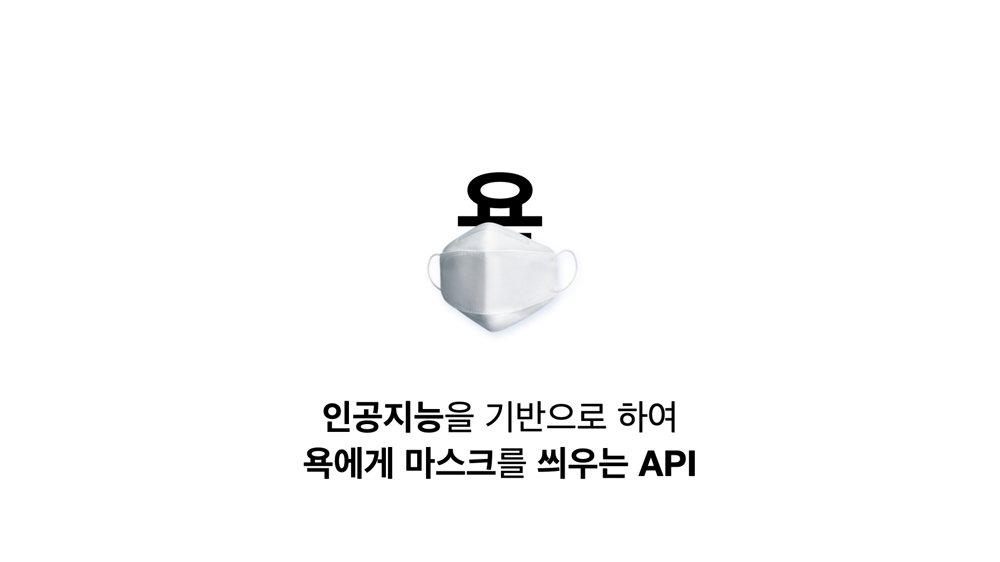

# 인공지능 기반 한국어 비속어 마스킹 

본 프로젝트는 인공지능을 기반으로 하여 문장 안에 있는 비속어를 파악하는 HTTP API 입니다. 

이 프로젝트는 제가 중학교 2학년 때, 프로그래밍에 빠져들게 되면서 만들게 된 저의 초기 프로젝트 중 하나인 <AI 선플 탐지기>의 헌정 프로젝트입니다. 제 상상의 실현을 도와준 API와 같이 저도 누군가에게 도움이 될 수 있는 API를 제공하고자 하였습니다. 

 

## How it can be working?

비속어를 마스킹하기 위해서는 해당 단어의 욕설 여부를 판단하는 것이 중요합니다. 다양한 방법이 있을수도 있지만 저는 형태소 단위로 tokenize를 진행한 다음에 욕설이 포함된 문장인지 구별하는 네트워크를 훈련시켰습니다. 최종적으로 훈련된 word embedding을 활용하여, 코사인 유사도와 같은 욕설들과의 유사도를 기반으로 욕설 마스킹을 진행했습니다. 

## Installation

- Use Docker

```bash
docker pull ghcr.io/yoonhero/yok2vec:latest
docker run -p 5000:5000 -d ghcr.io/yoonhero/yok2vec:latest
```


## Usage 

**API**

```
POST https://yoonhero.hopto.org/chk
```

**Request**

| Parameter | Type | Description |
| --- | --- | --- |
| `text` | `string` | Required. 마스킹 할 문장 | 
| `to` | `string` | Optional. 마스킹 문자열 |
| `min_sim` | `float` | Optional. 마스킹을 할 때의 최소 유사도 |


**Request**

| Parameter | Type | Description |
| --- | --- | --- |
| `result` | `string` | 결과 문장 |
